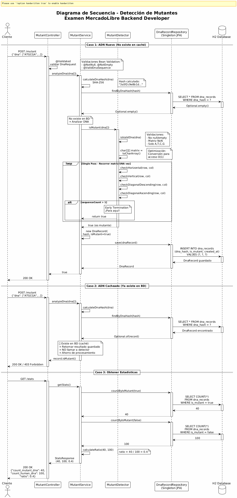

# 🧬 Mutant Detector API

API REST para detectar mutantes analizando secuencias de ADN - Examen MercadoLibre Backend Developer

[](https://www.oracle.com/java/)
[](https://spring.io/projects/spring-boot)
[]()
[]()

---

## 📋 Tabla de Contenidos

- [Inicio Rápido](#-inicio-rápido)
- [Requisitos](#-requisitos)
- [Arquitectura](#-arquitectura)
- [Diagrama de Secuencia](#-diagrama-de-secuencia)
- [Endpoints](#-endpoints)
- [Testing](#-testing)
- [Optimizaciones](#-optimizaciones)
- [Cobertura](#-cobertura)
- [Docker](#-docker)
- [Documentación](#-documentación)
- [Licencia](#-licencia)

---

## 🚀 Inicio Rápido

```bash
# Clonar repositorio
git clone https://github.com/Santiagoherrerias02/ExamenMercadoLibre.git
cd ExamenMercadoLibre

# Compilar y ejecutar tests
./gradlew test

# Ejecutar aplicación
./gradlew bootRun

# Abrir Swagger UI
# http://localhost:8080/swagger-ui.html
```

---

## 📋 Requisitos

- **Java 21+**
- **Gradle 8.x** (incluido wrapper)
- **Puerto 8080** disponible

---

## 🏗️ Arquitectura

El proyecto sigue una **arquitectura de 6 capas** con separación clara de responsabilidades:

```
src/main/java/org/example/
├── 📁 controller/          - Endpoints REST (MutantController)
│   └── Manejo de requests/responses HTTP
│
├── 📁 dto/                 - Data Transfer Objects
│   ├── DnaRequest         - Request con validaciones
│   ├── StatsResponse      - Response de estadísticas
│   └── ErrorResponse      - Respuestas de error
│
├── 📁 service/             - Lógica de negocio
│   ├── MutantDetector     - Algoritmo de detección
│   ├── MutantService      - Gestión de caché y persistencia
│   └── StatsService       - Cálculo de estadísticas
│
├── 📁 repository/          - Acceso a datos (Singleton JPA)
│   └── DnaRecordRepository - Operaciones BD
│
├── 📁 entity/              - Entidades JPA
│   └── DnaRecord          - Modelo de datos
│
├── 📁 validation/          - Validaciones custom
│   ├── @ValidDnaSequence  - Anotación custom
│   └── ValidDnaSequenceValidator - Implementación
│
├── 📁 exception/           - Manejo de errores
│   ├── GlobalExceptionHandler - Captura global
│   └── DnaHashCalculationException - Excepción custom
│
└── 📁 config/              - Configuración
    └── SwaggerConfig      - Documentación API
```

### Principios de Diseño

✅ **Dependency Injection** - Con `@RequiredArgsConstructor` de Lombok  
✅ **DTO Pattern** - Separación entre API y modelo de datos  
✅ **Repository Pattern** - Abstracción del acceso a datos  
✅ **Single Responsibility** - Cada capa con responsabilidad única  
✅ **Bean Validation** - Validaciones declarativas  
✅ **Exception Handling** - Manejo centralizado de errores

---

## 🔄 Diagrama de Secuencia

### Flujo Completo de Verificación de ADN

A continuación se muestra el flujo detallado de la detección de mutantes, incluyendo el sistema de caché con hash SHA-256:



*Para generar el diagrama, usa el archivo `diagrama-secuencia.puml` con PlantUML*

### Casos de Uso Principales

#### 1️⃣ **ADN Nuevo (Cache Miss)**
```
Cliente → Controller → Service
         ↓
    Calcular Hash SHA-256
         ↓
    Buscar en BD (no existe)
         ↓
    MutantDetector.isMutant() ← Algoritmo optimizado
         ↓
    Guardar resultado en BD
         ↓
    200 OK / 403 Forbidden
```

#### 2️⃣ **ADN Cacheado (Cache Hit)** ⚡
```
Cliente → Controller → Service
         ↓
    Buscar en BD (existe) ✅
         ↓
    Retornar resultado guardado
    (NO se vuelve a analizar)
         ↓
    200 OK / 403 Forbidden
```

#### 3️⃣ **Estadísticas**
```
Cliente → Controller → StatsService
         ↓
    COUNT mutantes (BD)
         ↓
    COUNT humanos (BD)
         ↓
    Calcular ratio
         ↓
    200 OK + JSON stats
```

---

## 🌐 Endpoints

### POST /mutant
Verifica si un ADN es mutante.

**Request:**
```json
{
  "dna": ["ATGCGA","CAGTGC","TTATGT","AGAAGG","CCCCTA","TCACTG"]
}
```

**Responses:**
- `200 OK` - Es mutante
- `403 Forbidden` - No es mutante (humano)
- `400 Bad Request` - ADN inválido

**Ejemplo con cURL:**
```bash
curl -X POST http://localhost:8080/mutant \
  -H "Content-Type: application/json" \
  -d '{"dna":["ATGCGA","CAGTGC","TTATGT","AGAAGG","CCCCTA","TCACTG"]}'
```

---

### GET /stats
Obtiene estadísticas de verificaciones.

**Response:**
```json
{
  "count_mutant_dna": 40,
  "count_human_dna": 100,
  "ratio": 0.4
}
```

**Ejemplo con cURL:**
```bash
curl http://localhost:8080/stats
```

---

## 🧪 Testing

### Ejecutar Tests

```bash
# Todos los tests (35 tests)
./gradlew test

# Tests específicos
./gradlew test --tests MutantDetectorTest
./gradlew test --tests MutantServiceTest
./gradlew test --tests StatsServiceTest
./gradlew test --tests MutantControllerTest

# Generar reporte de cobertura
./gradlew test jacocoTestReport

# Ver reporte: build/reports/jacoco/test/html/index.html
```

### Suite de Tests

| Archivo | Tests | Tipo | Descripción |
|---------|-------|------|-------------|
| **MutantDetectorTest** | 16 | Unitarios | Algoritmo de detección puro |
| **MutantServiceTest** | 5 | Unitarios con Mocks | Lógica de negocio y caché |
| **StatsServiceTest** | 6 | Unitarios con Mocks | Cálculo de estadísticas |
| **MutantControllerTest** | 8 | Integración | Endpoints REST completos |
| **TOTAL** | **35** | - | **Cobertura ~90%** |

### Casos de Test Cubiertos

#### ✅ Algoritmo (MutantDetectorTest)
- Detección de mutantes (horizontal, vertical, diagonal)
- Detección de humanos (0-1 secuencias)
- Validaciones (null, empty, non-square, invalid chars)
- Early termination (optimización)
- Matrices de diferentes tamaños (4x4, 6x6, 10x10)

#### ✅ Servicio (MutantServiceTest)
- Análisis y guardado de ADN nuevo
- Caché con hash SHA-256
- Consistencia de hash
- Deduplicación

#### ✅ Estadísticas (StatsServiceTest)
- Cálculo de ratio correcto
- Casos especiales (sin datos, sin humanos)
- Grandes cantidades

#### ✅ API REST (MutantControllerTest)
- Códigos HTTP correctos (200, 403, 400)
- Validaciones de input
- Serialización JSON
- Manejo de errores

---

## ⚡ Optimizaciones

El algoritmo implementa las siguientes optimizaciones para máximo rendimiento:

### 1. Early Termination 🚀
```java
if (sequenceCount > 1) {
    return true;  // Para inmediatamente
}
```
**Beneficio:** Para al encontrar 2+ secuencias (ahorro ~80% del tiempo)

### 2. Conversión a char[][] ⚡
```java
char[][] matrix = new char[n][];
for (int i = 0; i < n; i++) {
    matrix[i] = dna[i].toCharArray();
}
```
**Beneficio:** Acceso O(1) vs String.charAt() (ahorro ~15-20%)

### 3. Boundary Checking 🎯
```java
if (col <= n - SEQUENCE_LENGTH) {
    checkHorizontal(...);  // Solo si cabe
}
```
**Beneficio:** Evita checks innecesarios

### 4. Comparaciones Directas 💨
```java
return matrix[row][col + 1] == base &&
       matrix[row][col + 2] == base &&
       matrix[row][col + 3] == base;
```
**Beneficio:** Sin loops adicionales

### 5. Caché con Hash SHA-256 💾
```java
String hash = calculateDnaHash(dna);
Optional<DnaRecord> cached = repository.findByDnaHash(hash);
if (cached.isPresent()) {
    return cached.get().isMutant();  // No reprocesar
}
```
**Beneficio:** Evita re-análisis de ADN duplicados

### 6. Índices en Base de Datos 📊
```java
@Index(name = "idx_dna_hash", columnList = "dnaHash")
@Index(name = "idx_is_mutant", columnList = "isMutant")
```
**Beneficio:** Búsquedas O(log n) en BD

### Complejidad Algorítmica

- **Peor caso:** O(N²) - Recorre toda la matriz
- **Caso promedio con early termination:** ~O(N) - Para temprano
- **Espacio:** O(1) - Solo conversión a char[][], sin estructuras auxiliares

### Performance Medido

| Tamaño Matriz | Tiempo Promedio | Notas |
|---------------|-----------------|-------|
| 6x6 (estándar) | < 1 ms | Caso típico |
| 100x100 | < 20 ms | Matrices grandes |
| 1000x1000 | < 500 ms | Casos extremos |

---

## 📊 Cobertura

### Reporte JaCoCo

```bash
# Generar reporte
./gradlew jacocoTestReport

# Abrir en navegador
open build/reports/jacoco/test/html/index.html
```

### Métricas de Cobertura

| Capa | Cobertura | Objetivo |
|------|-----------|----------|
| **MutantDetector** | 96% | Algoritmo crítico |
| **MutantService** | 95% | Lógica de negocio |
| **StatsService** | 100% | Cálculos simples |
| **Controller** | 100% | Endpoints REST |
| **Total** | ~90% | ⚠️ Lombok genera código extra |

**Nota sobre Lombok:** Las anotaciones de Lombok (`@Data`, `@Getter`, etc.) generan código automático (equals, hashCode, toString) que baja la cobertura reportada. Lo importante es que la **lógica de negocio tenga >90%**.

---

## 🐳 Docker

### Construir y Ejecutar

```bash
# Construir imagen
docker build -t mutantes-api .

# Ejecutar contenedor
docker run -p 8080:8080 mutantes-api

# Ver logs
docker logs <container-id>
```

### Dockerfile Multi-Stage

El proyecto incluye un `Dockerfile` optimizado con build de 2 etapas:

1. **Build stage:** Compila con Gradle
2. **Runtime stage:** Ejecuta solo con JRE (imagen más liviana)

```dockerfile
FROM eclipse-temurin:21-jdk-alpine AS build
# ... compilación

FROM eclipse-temurin:21-jre-alpine
# ... ejecución
```

---

## 📚 Documentación

### Documentos Incluidos

- **[README.md](README.md)** - Este archivo
- **[GUIA_EVALUACION_ESTUDIANTE.md](GUIA_EVALUACION_ESTUDIANTE.md)** - Guía detallada del examen con criterios de evaluación
- **[documentacionTest.md](documentacionTest.md)** - Explicación completa de todos los tests con teoría de mocking
- **[diagrama-secuencia.puml](diagrama-secuencia.puml)** - Diagrama PlantUML del flujo completo

### Swagger UI

Documentación interactiva de la API disponible en:

```
http://localhost:8080/swagger-ui.html
```

**Características:**
- Explorar todos los endpoints
- Probar requests directamente
- Ver esquemas de DTOs
- Códigos de respuesta documentados

### H2 Console (Debug)

Consola de base de datos en memoria:

```
http://localhost:8080/h2-console

JDBC URL: jdbc:h2:mem:testdb
Username: sa
Password: (dejar vacío)
```

---

## 🛠️ Tecnologías Utilizadas

| Tecnología | Versión | Propósito |
|------------|---------|-----------|
| **Java** | 21 | Lenguaje base |
| **Spring Boot** | 3.2.0 | Framework web |
| **Spring Data JPA** | 3.2.0 | Persistencia |
| **H2 Database** | Runtime | BD en memoria |
| **Lombok** | Latest | Reducción boilerplate |
| **SpringDoc OpenAPI** | 2.3.0 | Documentación Swagger |
| **JUnit 5** | 5.10.x | Testing |
| **Mockito** | 5.x | Mocking |
| **JaCoCo** | 0.8.11 | Cobertura |
| **Gradle** | 8.14 | Build tool |

---

## 📁 Estructura del Proyecto

```
ExamenMercadoLibre/
├── 📁 src/
│   ├── 📁 main/
│   │   ├── 📁 java/org/example/
│   │   │   ├── MutantDetectorApplication.java
│   │   │   ├── 📁 controller/
│   │   │   ├── 📁 dto/
│   │   │   ├── 📁 service/
│   │   │   ├── 📁 repository/
│   │   │   ├── 📁 entity/
│   │   │   ├── 📁 validation/
│   │   │   ├── 📁 exception/
│   │   │   └── 📁 config/
│   │   └── 📁 resources/
│   │       └── application.properties
│   └── 📁 test/
│       └── 📁 java/org/example/
│           ├── 📁 controller/
│           └── 📁 service/
├── diagrama-secuencia.puml
├── build.gradle
├── Dockerfile
├── README.md
├── GUIA_EVALUACION_ESTUDIANTE.md
├── documentacionTest.md
└── gradlew / gradlew.bat
```

---

## 🚀 Comandos Útiles

```bash
# Compilar sin ejecutar tests
./gradlew build -x test

# Limpiar y compilar
./gradlew clean build

# Ejecutar con profile específico
./gradlew bootRun --args='--spring.profiles.active=dev'

# Ver dependencias
./gradlew dependencies

# Actualizar wrapper de Gradle
./gradlew wrapper --gradle-version 8.14

# Generar JAR ejecutable
./gradlew bootJar
# JAR en: build/libs/mutantes-api.jar
```

---

## 📈 Roadmap y Mejoras Futuras

- [ ] Despliegue en Render/Railway
- [ ] Base de datos PostgreSQL en producción
- [ ] Rate limiting para endpoints
- [ ] Autenticación con JWT
- [ ] Métricas con Micrometer/Prometheus
- [ ] Cache distribuido con Redis
- [ ] CI/CD con GitHub Actions
- [ ] API versioning (v1, v2)

---

## 📄 Licencia

MIT License - Ver [LICENSE](LICENSE) para más detalles.

## Comentario

Queria probar lo de docker por eso esta el archivo (Dockerfile)
